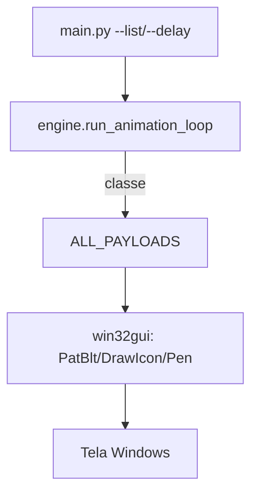

# 🪟 Win32-Payload-Engine — Motor de Efeitos GDI em C/Python
<p align="center">
  
  <a href="https://github.com/panda12332145/Win32-Payload-Engine/commits/main"></a>
  <a href="https://github.com/panda12332145/Win32-Payload-Engine"></a>
  
</p>
---
> ⚠️ **Windows/lab apenas:** efeitos desenhados na tela do sistema (GDI). Use em máquinas virtuais ou ambientes autorizados; nunca em produção.

---
## 🔖 Resumo

**Motor de payloads visuais GDI para Windows**: cada efeito (retângulos, círculos, espiral, raios de sol, **ícones aleatórios** e **cubo rotativo de ícones 3D**) é uma classe plugável registrada em `ALL_PAYLOADS`. O engine itera os payloads com delay configurável, limpa/recupera o DC da tela e encerra com Ctrl+C. Os dois efeitos clássicos (`as.py` e `as - Copia.py`) foram **portados para o módulo único** `src/payloads.py`.

### ✨ Funcionalidades Principais

- ✅ 6 payloads plugáveis — registre novos com uma classe nova
- ✅ **IconCubePayload**: projeção 3D de rotação (XYZ) com ícones do sistema — portado do legado
- ✅ **IconsPayload**: ícones sorteados em posições aleatórias — portado do legado
- ✅ CLI com `--list`, `--delay` e `--once` (execução única p/ demo)
- ✅ Testes com **GDI mockado** — a suíte roda em Linux/macOS/CI
- ✅ Sem resíduos na raiz: legados `as.py`/`as - Copia.py` removidos

## 📽 Demonstração

```text
$ python main.py --list
RectanglesPayload
CirclesPayload
SpiralPayload
SunraysPayload
IconsPayload
IconCubePayload

# Windows:
python main.py --delay 0.05
```

## ⚙️ Explicação das Partes Importantes

### Cubo 3D por quadro (`IconCubePayload.draw`)

```python
win32gui.PatBlt(hdc, 0, 0, w, h, win32con.BLACKNESS)
x, y, z = self._rot(i, j, k, self.A, self.B, self.C)
z += self.dist
if z > 0:
    xp = int(w / 2 + self.focal / z * x)
    win32gui.DrawIcon(hdc, xp, yp, icon)
self.A += 0.03; self.B += 0.02; self.C += 0.01
```

> Cada chamada avança um quadro: o engine chama `draw()` em loop e a rotação progride sem estado global.

### Registro de payloads

```python
ALL_PAYLOADS = [
    RectanglesPayload, CirclesPayload, SpiralPayload, SunraysPayload,
    IconsPayload, IconCubePayload,
]
```

> Basta acrescentar a classe na lista — o CLI e o loop passam a incluí-la automaticamente.

## 🔄 Fluxo de Trabalho / Arquitetura



## 📂 Estrutura do Projeto

```plaintext
Win32-Payload-Engine/
├── main.py               # CLI: --list, --delay, --once
├── src/
│   ├── engine.py         # loop do motor + listagem
│   └── payloads.py       # 6 payloads (GDI) registrados
├── tests/test_payloads.py  # 4 testes com GDI mockado
├── requirements.txt      # pywin32 (só Windows)
└── README.md
```

## 🛠️ Tecnologias

| Ferramenta | Uso |
|---|---|
| **Python 3** | Linguagem |
| **pywin32** | APIs GDI (win32gui/api/con) |
| **unittest.mock** | Suíte multiplataforma |

## ▶️ Instalação

```bash
git clone https://github.com/panda12332145/Win32-Payload-Engine.git
cd Win32-Payload-Engine
pip install -r requirements.txt   # pywin32 instala só no Windows
```

## 🚀 Execução

```bash
# Listar payloads:
python main.py --list

# Rodar efeitos (Windows):
python main.py --delay 0.05
python main.py --once            # uma passada e sai

# Testes (qualquer SO — GDI mockado):
python tests/test_payloads.py
```

## 🧪 Testes

4 testes automatizados: registro completo dos 6 payloads, cada `draw()` sem exceção com HDC mockado, avanço de quadro do cubo e execução única do engine sem travar.

## ⚠️ Limitações

- Efeitos rodam em Windows de verdade apenas (a suíte cobre a lógica com mocks)
- Sem som nem captura de teclado — é puramente visual
- Um ciclo mostra todos os efeitos em sequência (modo show)

## 🚀 Roadmap

- [ ] Payloads com progresso/tempo (fade)
- [ ] Presets de duração por efeito
- [ ] Suporte a múltiplos monitores

## 📄 Licença

Todos os direitos reservados ao autor.

---

## 👾 Autor

<p align="center">
  
</p>

<p align="center">Feito por <strong>Panda12332145</strong> 👋🏽</p>

---

## 🧑‍💻 Sobre Mim

Sou apaixonado por **Física Teórica, Cibersegurança e Desenvolvimento de Sistemas**. Tenho grande interesse em programação de baixo nível, engenharia reversa, automação, sistemas Windows, criptografia e segurança ofensiva. Também gosto bastante de música, filosofia e computação avançada.

---

## 🌐 Redes

* **Site:** [https://panda-h0me.netlify.app/](https://panda-h0me.netlify.app/)
* **YouTube:** [https://www.youtube.com/@X86BinaryGhost](https://www.youtube.com/@X86BinaryGhost)
* **Instagram:** [https://www.instagram.com/01pandal10/](https://www.instagram.com/01pandal10/)
* **GitHub:** [https://github.com/panda12332145](https://github.com/panda12332145)
* **LinkedIn:** [linkedin.com/in/athos-da-boanergis](https://www.linkedin.com/in/athos-d%C3%A3-boanergis-5585a4288/)

---

## 🚀 Áreas de Interesse

* **Cibersegurança Avançada** 🔒
* **Hacking & Engenharia Reversa** 💻
* **Computação de Baixo Nível** 🖥️
* **Matemática e Física Teórica** 📐⚛️
* **Desenvolvimento de Ferramentas de Segurança** 🛠️

_"Conhecimento é poder, e domínio técnico vem da compreensão profunda dos sistemas."_

---

## 📞 Contato & Suporte

Para colaborações, dúvidas ou sugestões:

📧 **E-mail:** [athos.cybersec@gmail.com](mailto:athos.cybersec@gmail.com)

🐛 **Reportar Bug:** [Abrir Issue](https://github.com/panda12332145/Win32-Payload-Engine/issues)

💡 **Sugerir Melhoria:** [Discussions](https://github.com/panda12332145/Win32-Payload-Engine/discussions)

## 📊 Métricas

<!-- metrics:start -->
| Métrica | Valor |
|---|---|
| ⭐ Stars | 0 |
| 🍴 Forks | 0 |
| 📌 Issues abertas | 0 |
| 🕐 Último commit | 2026-09-30 |
<!-- metrics:end -->
